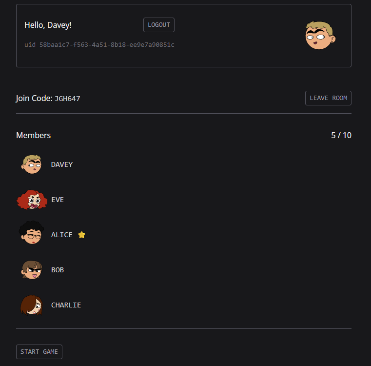
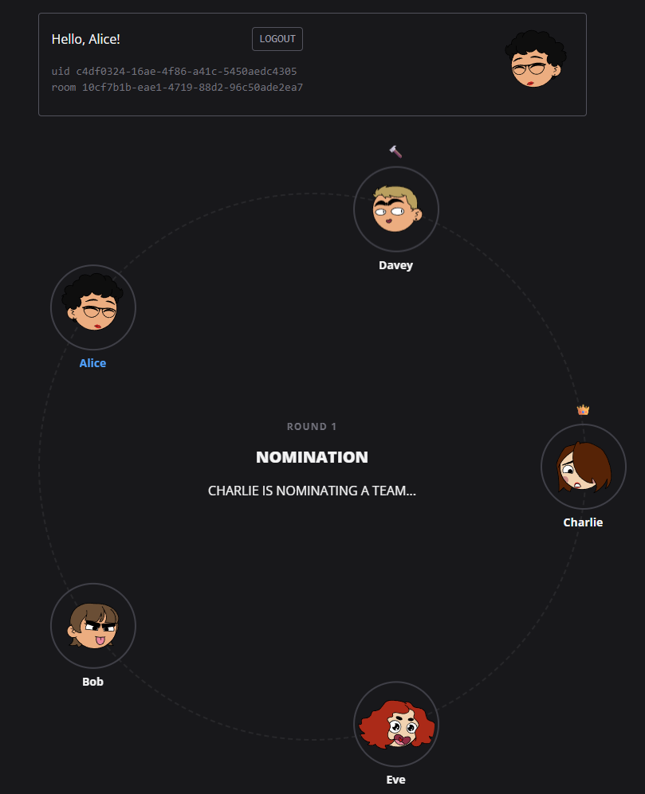
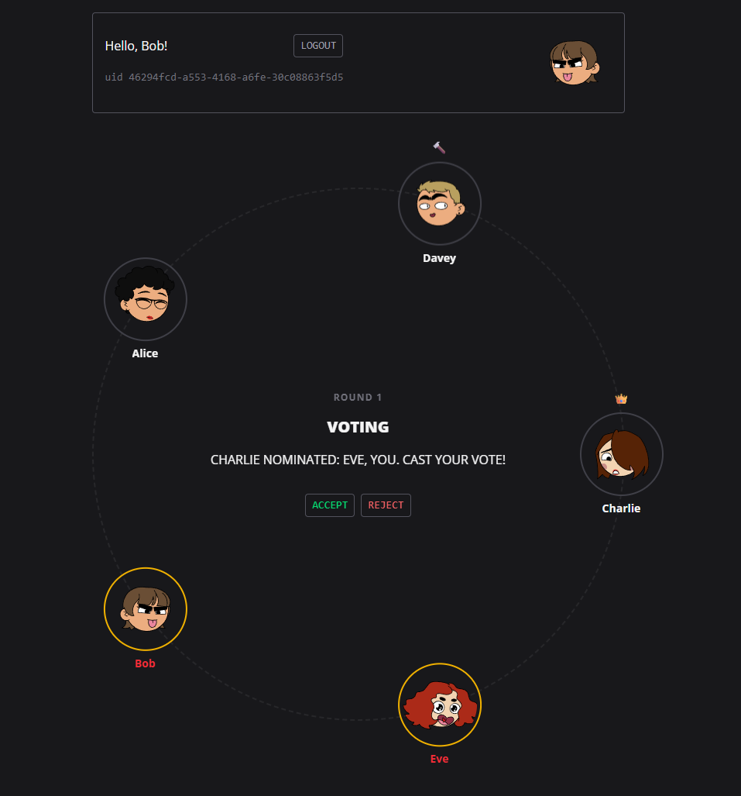
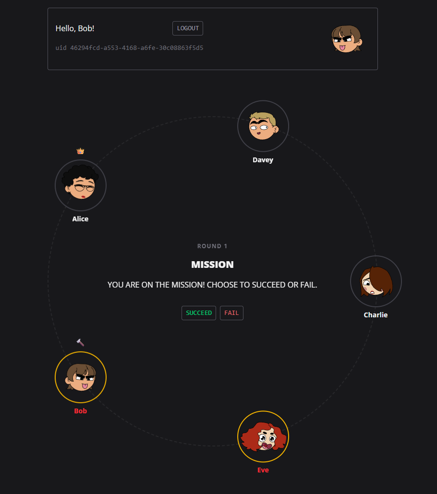

# info

this project is not finished 100% but the game is playable

  
  
  
  

# installation

- fill out the .env file (example environment variables are at .env.example)

- run `docker compose up`

# "the resistance" game

this is web game based on "the resistance" rules.

5 to 10 players, 2 to 4 spies vs agents, in 5 missions.

agents/spy ratio:
5/2, 6/2, 7/3, 8/3, 9/4, 10/4

in every round a leader nominates a team of players,
players go on mission - if they are spy - they can fail the mission.
agents role is to find the spies and not nominate them to missions.
spies must stay hidden and fail 3 missions.
after 5 rejected team nominations, the hammer falls and agents lose.

# tech stack

## frontend

- vite (for development)
- react
- zustand
- tailwind

## backend

- golang
- rest api for actions
- sse for events

## database

- redis (lobby, gameplay)

## reverse proxy

nginx

# user flow

## auth

on main page of app, there will be guest login.
user provides his username and random avatar hash of their choice
after logging in -> JWT token in cookies.
token payload: id, username, avatar.

## room

users can create new room, user that has created the room is a leader.
users can join room by the join code.

### expiration

we remove the room immediately if all players leave
or there is 30m inactivity.
players can only create one room.

### leader

- kick players
- start the game
- change settings
- give away room leader role

### settings

- room max players
- room private/public

#### game rules

game paces:
RELAXED, STANDARD, COMPETITIVE

timers

- nominate (30s - 120s)
- team vote (15s - 60s)
- mission (10s - 30s)

hide or show past mission team voting,
hide or show past mission participants.

## gameplay

users POST action to /api/rooms/[room_id]

users get room state updates from SSE by GET /api/rooms[room_id].
SSE always sends full room state (on SSE connection join and on state update).

### game phases

#### lobby

game state is clean,
players can join the room,
room settings can be changed by room leader,
game can be started by room leader if there are enough players.

when game starts

- roll the player roles
- roll leaders order
- set phase to nomination

#### nomination

leader is nominating a team of players, he has default 30s timeout (or timeout set in settings).
after timeout, the hammer increments, next leader is nominating.
if leader nominate a team, the team vote phase starts,
else if leader has not nominated a team or team got rejected and hammer is 4/5 (5 is number of players),
then agents lose.

#### team vote

players vote on the current nominated team.
they can reject or approve the team,
after timeout the player vote is automatically rejected.
if majority of votes are approved then we go to mission phase,
else increment the hammer, set next leader and go back to nomination phase.

#### mission

we reset the hammer count,
team is voting on mission,
spies can do fail or success,
agents can do only success.

after timeout

- agent do success automatically
- spy do fail automatically

if there is at least one fail in the mission,
then mission is marked as failed,
else the mission is marked as succeed.
we show the count of fail votes after mission.
in some missions (7+ players) there must be at least 2 fail votes.

we check if there are total 3 succeed or failed missions,
and show the game result

#### finish

game is ended with a reason (hammer or mission votes),
we dont hide the roles anymore,
we reveal history of team votes (if was hidden),
players can leave or stay,
room leader can reset the game to the lobby for rematch.

we save the game result to database (match history).

# backend

api routes

## endpoints

### POST `/api/rooms` create new room

### DELETE `/api/rooms` leave room

### GET `/api/rooms/[room_id]` SSE room events

### POST `/api/rooms/[room_id]` add user to room

### PUT `/api/rooms/[room_id]` update room settings

### DELETE `/api/rooms/[room_id]` remove room

### POST `/api/rooms/[room_id]/action` game action

## game action

every action gets validated in redis lua script,
then lua modifies room state, makes a publish notification
so SSE knows when to send update to users,
lua returns room `expires_at` that fires `time.AfterFunc`
which will run PHASE_TIMEOUT lua script after the phase timeout runs out.

## game SSE

player:

- must be authenticated via JWT
- must be in the room.

pub/sub notifies about update
-> get room state from redis
-> event emitter emits the state to SSE
-> SSE filters data and sends it to every player

we filter sensitive data for every player.
spies can only see the role of other spies.
agents can only see their own role.
other players have "ANON" role displayed.

### game reconnection

connection states:

- `online` - connected to SSE
- `unstable` - SSE dropped, 10s grace period
- `disconnected` - grace period expired, auto-actions trigger

players will rejoin the same room,
on SSE disconnect player is in unstable state for 10s,
then player is disconnected.

disconnected players actions become auto-actions:

- `nomination` - random nomination
- `team vote` - reject if not in proposed team, else approve
- `mission` - spy fail, agent success

other players can vote to end the game
when someone is disconnected.

- popup shows immediately after `disconnected` state
- only in active games
- needs majority to end game and go back to lobby
- next popup after next disconnect

## store

### redis

#### `user:{id}:data` HASH

stores user data

created at room join
deleted on room leave

- username
- avatar

#### `user:{id}:room` id

stores id of room that user is in.
used to prevent user being in 2 rooms at a time.

#### `room:{id}:data` HASH

- owner (id)
- join_code (string)
- state ("LOBBY", "PLAYING")

// setings

- max_players int
- game_pace STANDARD, RELAXED, COMPETETIVE

#### `join_code:{id}` id

stores id of a room that the join code points to

#### `room:{id}:state` HASH

room game state, created at `START_GAME` action.

- phase ("NOMINATE", "VOTE", "MISSION")
- phase_expires_at unix
- round int (starts from 1)
- mission_fail_count int
- hammer ID (player that is holding a hammer)
- leader ID (player who is nominating a team)

- game_result ("SPY", "AGENT", "HAMMER", "SURRENDER")

#### `room:{id}:nomination` SET

set of nominated players id
DEL after voting.

#### `room:{id}:votes:{round}` HASH

nomination votes
map: player_id -> vote (bool)
DEL after rejected voting.

#### `room:{id}:mission:{round}` HASH

map: player_id -> vote (bool)
on frontend we only return {fail_count} and {participants}

#### `room:{id}:presence` ZSET

store members presence
id -> last heartbeat

#### `room:{id}:members:id` SET

store room player ids in SET for fast look ups

#### `room:{id}:members:order` LIST

players turn order defined by order in this list.
created on `START_GAME` action, players are randomly
pushed into the list.

#### `room:{id}:members:spy` SET

player ids who are the spies

## error handling

What errors can occur?

- Room full
- Game already started
- Invalid action for current phase
- Not your turn

How are errors communicated?

- HTTP status codes + message code ("ROOM_FULL", "INVALID_ACTION" etc.)
